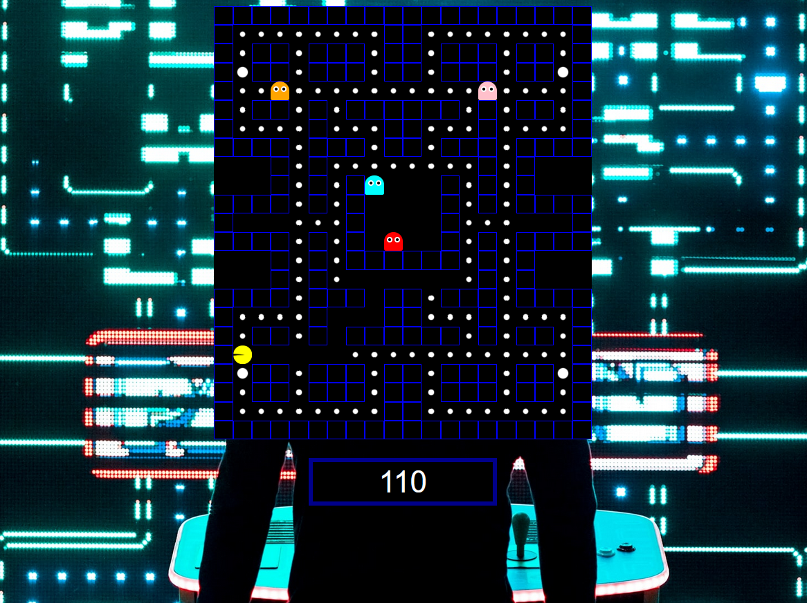

<!-- PROJECT LOGO -->
<br />
<p align="center">
  <a href="https://github.com/jeiku/javascript-pacman">
    
  </a>

  <h3 align="center">Javascript Pacman</h3>

  <p align="center">
    Pacman game built in HTML, CSS and Javascript
    <br />
    <br />
    <a href="#"><strong>View Demo »</strong></a>
  </p>
</p>

<!-- TABLE OF CONTENTS -->
<details open="open">
  <summary>Table of Contents</summary>
  <ol>
    <li>
      <a href="#about-the-project">About The Project</a>
    </li>
    <li>
      <a href="#getting-started">Getting Started</a>
      <ul>
        <li><a href="#installation">Installation</a></li>
      </ul>
    </li>
    <li><a href="#license">License</a></li>
  </ol>
</details>

<!-- ABOUT THE PROJECT -->

## About The Project


<br />

A fun and simple pacman gme built in HTML, CSS & Javascript. Move with the arrow keys. Eat all the pellets!

<!-- GETTING STARTED -->

## Getting Started

To get a local copy up and running follow these simple steps.

### Installation

1. Clone the repo
   ```sh
   git clone https://github.com/jeiku/javascript-pacman.git
   ```
2. Install NPM packages

   ```sh
   npm install
   ```

3. Start game on local host
   ```sh
   npm start
   ```

<!-- LICENSE -->

## License

Distributed under the MIT License. See `LICENSE` for more information.
